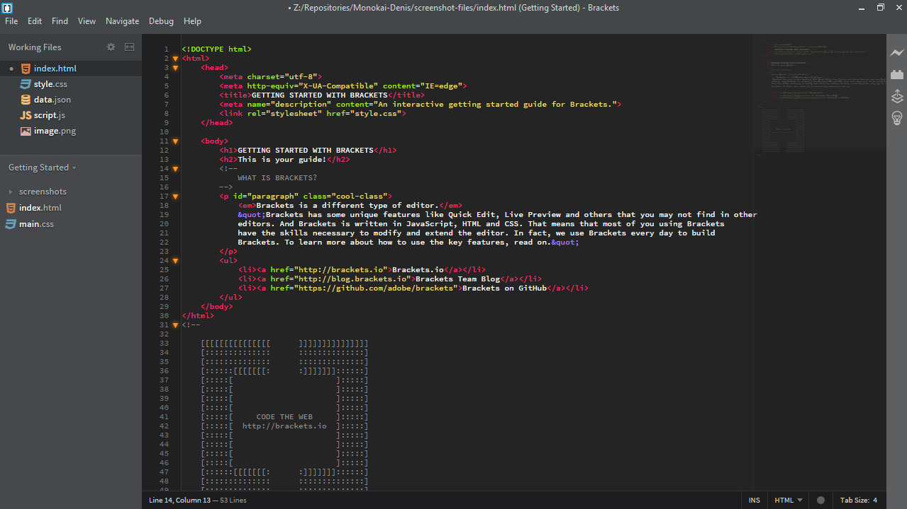
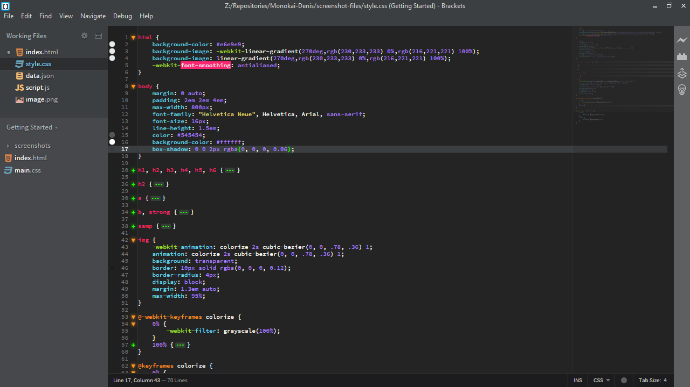
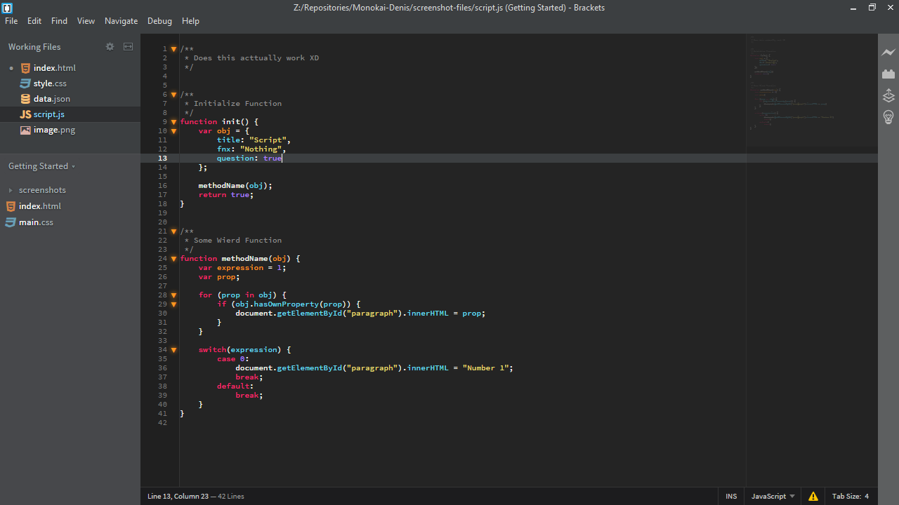

# Monokai-Denis
Brackets Dark theme based on Monokai color scheme from Sublime Text. 
Based on the Monokai-Dark-Soda theme from https://github.com/rainje/Monokai-Dark-Soda/

Screenshots
---

### HTML

### CSS

### JavaScript

### JSON

### Images

Installation
---

This extension requires Brackets 1.3 or newer.

1. Open Brackets
2. Open the extension manager (Extensions "Lego Brick" button on the right)
3. Click the Themes tab
4. Search for ‘Monokai Denis’
5. Click install

OR

Install via url (https://github.com/DDDGamer/Monokai-Denis)

Note
---
File Icons do not come with the theme, install seperately
https://github.com/drewbkoch/Brackets-File-Icons
or
https://github.com/ivogabe/Brackets-Icons

MiniMap does not come with the theme, install seperately
https://github.com/zorgzerg/brackets-minimap

Supported extensions
---
* [Brackets Css Color Preview](https://github.com/cmgddd/Brackets-css-color-preview)
* [Brackets-Git](https://github.com/zaggino/brackets-git)
* [Match Highlighter](https://github.com/gintau/bracket-match-highlighter)

Have Suggestions/See Problems? Open an issue! :D

License
---

The MIT License. Read [LICENSE](LICENSE) for further information.
